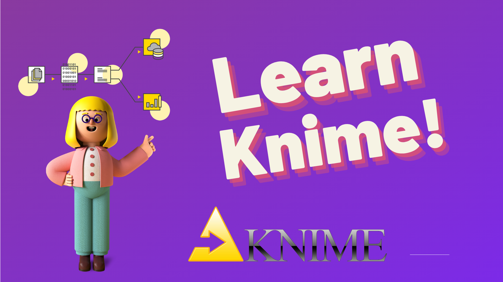

# Knime

## Knime Learning

>If you are a newcomer to the Knime Learning area, the first question you may have is "What is Knime"

>Here is a downloading link for knime 

>Download the latest KNIME Analytics Platform for Windows, Linux, and Mac OS X.

https://www.knime.com/downloads/download-knime 

I would continue adding new workflow to this repo.

---------------------------------------

## 1 Regression Model 

:star: https://github.com/zeynepkucuk/Knime/tree/main/RegressionModel 

## 2 Classification 

:star: https://github.com/zeynepkucuk/Knime/tree/main/Classification 

## 3 Multi Layer Perceptron 

:star: https://github.com/zeynepkucuk/Knime/tree/main/MultiLayerPerceptron

## 4 Support Vector Machine

:star: https://github.com/zeynepkucuk/Knime/tree/main/SVM

## 5 K-Means Algoritm 

:star:https://github.com/zeynepkucuk/Knime/tree/main/K-meansAlgorithm

https://www.youtube.com/watch?v=AFIxCwYdQ6g 

